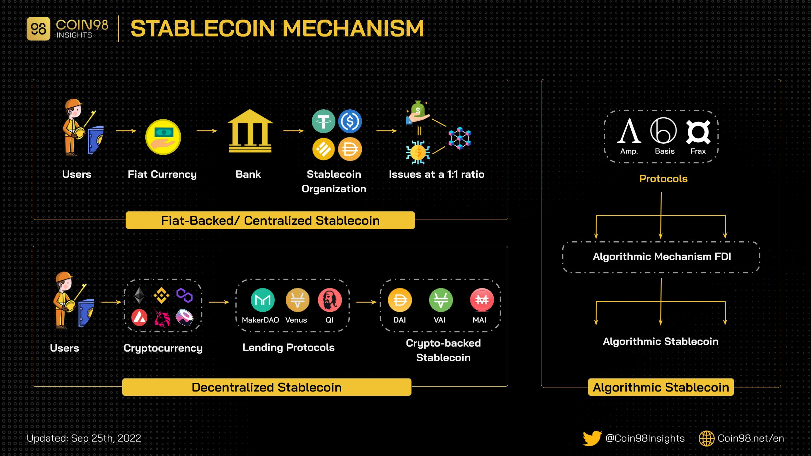
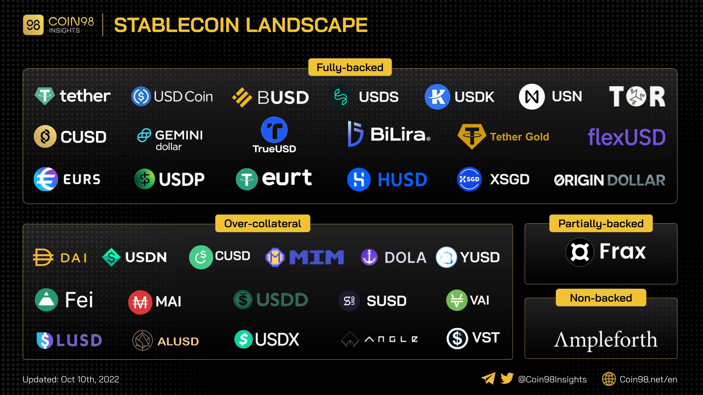

# StableCoins

## Overview and types
### StableCoins Overview and types 

### StableCoins Mechanism

### StableCoins Landscape

## Algorithmic Stablecoins
- [Algorithmic Stablecoins](https://www.coinbureau.com/education/algorithmic-stablecoins/)
- [算法稳定币赛道分析](https://mirror.xyz/0xe41A72239b37e72a5daAa1C7fA1d32C31B3f87Dd/BG-w6SxHEHekUWNX-iN8z0GHMuyLngI5Xdl2J2Kat80)
- 死亡螺旋 vs 旁氏骗局
  - 历史上著名的旁氏骗局
  - 旁氏骗局变种 🧐

### 👀
[TrueUSD (TUSD)](https://cryptonews.com/coins/trueusd#trueusd-tusd-vs-tether-usdt-vs-usd-coin-usdc-comparison)